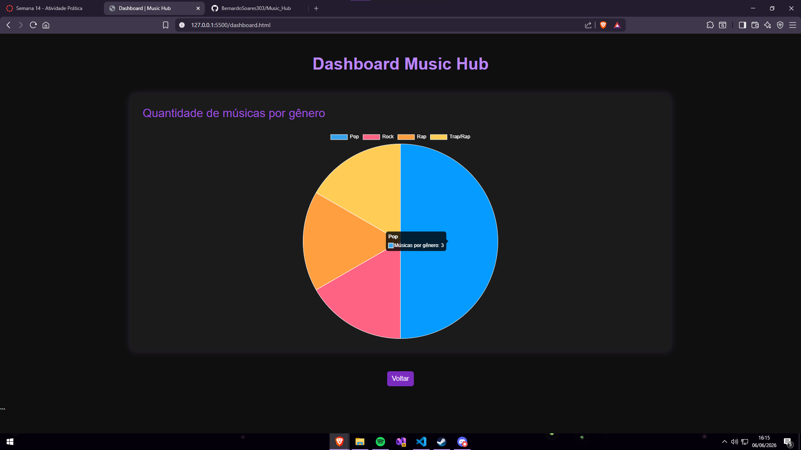
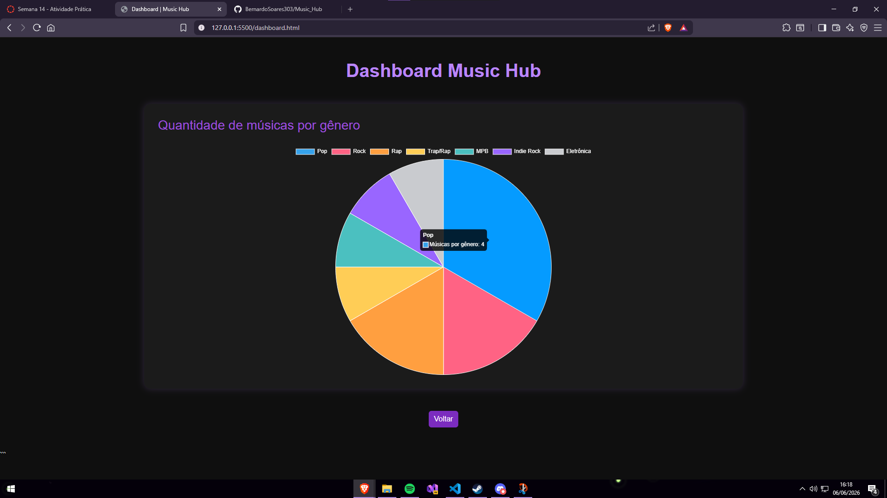

# Music Hub

Projeto desenvolvido para a disciplina de Desenvolvimento Web.

## Autor

Bernardo Soares De Sousa Cozer

## Funcionalidade dinâmica

Foi implementado um dashboard utilizando a biblioteca Chart.js para apresentar a quantidade de músicas cadastradas por gênero.

O gráfico é atualizado dinamicamente a partir dos dados em JSON do projeto.

## Tecnologias utilizadas

* HTML
* CSS
* JavaScript
* Bootstrap
* Chart.js

## Prints

### Dashboard 1

### Dashboard 2

